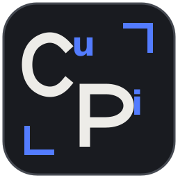
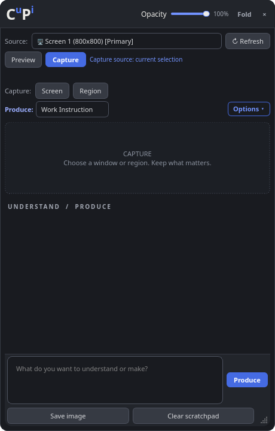
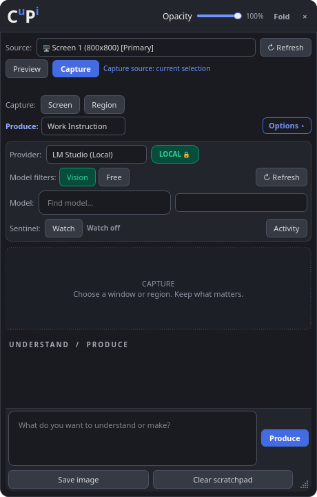

<p align="center">
  
</p>

# CᵘPⁱ — Desktop scratchpad

**Capture, powered by understanding. Produce, powered by intelligence.**

CᵘPⁱ (`cupi`) is a desktop scratchpad for capturing context, exploring it with AI,
and producing useful documents from evidence. Its dark desktop identity uses
blue superscripts and capture corners, with a scalable icon for small sizes.

A cross-platform floating desktop AI companion. Application features depend on the `PlatformBackend` API; Linux/X11, Linux/Wayland, and Windows are separate adapters, with a macOS stub reserved for later implementation.

> **Hyprland status:** the bundled native helper captures a selected application cleanly—even on another workspace—without changing the current workspace or moving windows. If that helper is unavailable, the app never substitutes a current-workspace region crop for an inactive-workspace request.

## Desktop preview

| Scratchpad | Connection and model options |
| :---: | :---: |
| [](docs/media/desktop-scratchpad.png) | [](docs/media/desktop-options.png) |

Actual app previews rendered with temporary settings and no private captures.
Click either image to view it at full size.

## Architecture

* `platform_api/`: OS-neutral capture, window, cursor, hotkey, permission, and capability API.
* `platform_api/linux_x11.py`: all `xprop`, `xwininfo`, `xdotool`, and `x11grab` behavior.
* `platform_api/linux_wayland.py`: Wayland-safe adapter with grim monitor/region capture and Hyprland clean-window capture.
* `platform_api/windows.py`: native Win32 window enumeration/focus plus Qt capture.
* `storage/`: portable (`portable.flag` + `./data`) and installed per-user layouts.
* `sessions/`: versioned OS-neutral SOP session/step representation.

Place an empty `portable.flag` beside the executable (or source entry point) to keep all state under `./data/{config,sessions,captures,exports,logs}`.

---

## 🌟 Key Features (Currently Implemented)

### 1. 🛡️ Sentinel Watchdog (Passive Co-Pilot Mode)
* **Zero-Cost Background Monitoring**: Periodically observes target windows or displays (~37ms processing time) using channel-correct 3D NumPy array differencing. Uses 0 API tokens and makes zero network calls while idle.
* **Dual-Threshold Motion Hysteresis**: Ignores blinking text cursors, typing jitter ($1.6\% - 2.2\%$), and tab switches, preventing observation resets during normal typing.
* **Latched Candidate Engine & Fingerprinting**: Uses `CandidateState` enums, `hashlib.sha256` stable digests, and 64-bit block average perceptual crop hashing (Hamming distance $\le 6$) to eliminate 2-second repeat candidate log loops.
* **Composite Anomaly Scoring**: Evaluates persistent regions (+3), new red color accents (+2), text-like edge density (+1), and dialog geometry (+1) without requiring any single color as a mandatory gate.
* **Non-Intrusive Floating Toast HUD Popup**: Displays a bottom-right HUD alert when anomaly score $S \ge 3$:
  * **`🔍 Inspect with AI`**: Auto-dismisses HUD, suppresses fingerprint from re-alerting, populates prompt, and attaches cropped error screenshot ready for review.
  * **`🔕 Mute 5m`**: Temporarily mutes toasts for 5 minutes while maintaining background monitoring and releasing crop memory.
  * **`❌ Dismiss`**: Suppresses the specific candidate fingerprint.
* **In-App Evaluation Log Modal (`📊 Log`)**: Real-time performance dashboard displaying latency, processed/dropped frame metrics, candidate counts, and persistent event logging (`~/.local/share/ai_work_companion/logs/sentinel_events.log`).

### 2. 🎨 CᵘPⁱ UI & Resizable Workspace
* **Generous Source & Model Selectors**: 3-row layout ensures target window/monitor titles in **Source** dropdown and model names in **Model** dropdown are fully readable without truncation.
* **Frameless Always-On-Top UI**: Includes collapse/expand toggle (`🔽 Collapse`), titlebar drag handles, and dynamic cursor indicators (`<->`, `^v`, `\`, `/`) with a bottom-right `QSizeGrip` handle.
* **Production-First Hierarchy**: The interface focuses on one snapshot, one selected production type, one request, and one export—not an ongoing chat stream.
* **Readable Cross-Platform Type**: Prefers Inter, Segoe UI Variable, Segoe UI, and Noto Sans with platform fallbacks.
* **Window Transparency Slider**: Live opacity control slider (`👁️ 30% - 100%`). The app starts fully opaque for readability.

### 3. 🎯 Unobscured Target Capture Pipeline
* **Source Selector**: Choose any display monitor or managed window (Firefox, Terminal, IDE, etc.); Hyprland window labels include their workspace.
* **Target Picker Overlay**: Click and drag across the screen to visually target any window or custom screen area.
* **X11 Window Capture**: Uses `ffmpeg -f x11grab` for the selected window, with a visible-region fallback. Covered windows may include overlapping content; check **Preview** before using a capture.
* **Hyprland Clean Window Capture**: Uses Hyprland's toplevel-export protocol for a selected window, including windows on inactive workspaces, so its client surface is captured cleanly even when the desktop is cluttered or another window is above it.
* **Self-Hiding Companion**: Companion window temporarily hides during capture so it never overlays the captured image.

### 4. 🖼️ Current Snapshot & Screen Saving
* **Add Capture**: Captures the selected target as the current editable snapshot only. A new capture replaces the prior snapshot, and nothing is sent to AI until you choose **Ask AI**.
* **Save Screenshot**: Instantly captures target window/screen and saves numbered images (`capture_step_01_...png`) to `~/.local/share/ai_work_companion/captures/` without sending them to AI.
* **Editable Snapshot**: Reopen annotations or clear the current snapshot before requesting a production.

### 5. 📍 Screen Annotations & Reasoning Support
* **Re-editable Annotations**: Reopen and revise annotations for the current snapshot; AI annotations replace the exported image only.
* **Multi-Tuple Coordinate Parsing**: Robustly parses all vision model coordinate tuple formats (`[(x1, y1), (x2, y2)]`, `[x1, y1, x2, y2]`, `(x, y)`), drawing clean hollow red rounded boxes/circles on thumbnails and stripping raw XML tags from user text.
* **Reasoning Model Support**: Robustly handles OpenRouter reasoning models (`choices[0].message.reasoning` / `reasoning_content`) and displays raw provider JSON previews on error returns.

### 6. 🔒 Dual Provider Connections & Privacy
* **LM Studio (Local 🔒)**: Connects to local server (`http://localhost:1234/v1`). With the default loopback URL, requests go to your local server. Privacy depends on that server and any custom endpoint you configure.
* **OpenRouter (Hosted 🌐)**: Connects to hosted multimodal models (`https://openrouter.ai/api/v1`) with explicit online confirmation modal.

### 7. 📄 Guide Drafting & Export
* **Production Types**: Create a Work Instruction, SOP, Teaching Guide, Study Guide, or Quick Reference from your request and current snapshot.
* Preserves conversation context across turns, including screenshot history. Retained images are resent with follow-up requests; use **Clear Chat** before switching tasks or providers.
* **Export Guide** creates PDF, editable Word (.docx), standalone HTML with embedded screenshots, and Markdown, plus a ZIP bundle containing all formats and the original PNG evidence. Tables, lists, links, and code blocks are rendered from the same Markdown source. Repeated exports receive separate folders. Word export requires `python-docx`.

---

## 🛠️ Setup & Requirements

### System Requirements
* Primary release target: Linux X11 and Hyprland/wlroots Wayland. Windows has a native adapter/build script but needs live release testing. macOS support is limited and has no public build. GNOME/KDE Wayland portal capture is not implemented.
* Python 3.10+
* System utilities: `ffmpeg`, `xwininfo`, `xdotool`, `xprop` (standard X11 tools); Hyprland Wayland builds also need `grim`, `slurp` (recommended for area selection), `hyprctl`, `wayland-scanner`, `wayland-client`, `pkg-config`, and a C++ compiler.

### Python Dependencies
Install required packages:
```bash
python3 -m venv .venv
source .venv/bin/activate
python -m pip install -r requirements.txt
```

---

## 🚀 Quick Start

### 1. Launching the App
Run the convenience script:
```bash
./run.sh
```
The launcher uses `.venv/bin/python` when a local virtual environment exists, otherwise `python3`.

Or launch directly with Python:
```bash
python3 main.py
```

### Hyprland: test clean capture across workspaces

The source checkout needs the native helper before it can capture a window on
another workspace without switching to it. Build it once, then launch normally:

```bash
./packaging/build_hyprland_helper.sh
./run.sh
```

Choose a window labelled with its workspace in **Source**, stay on your current
workspace, and use **Preview** or **Add Capture**. If clean capture cannot
run, the app fails safely instead of capturing the current workspace at the
same screen coordinates.

### 2. Activating Sentinel Watchdog
1. Select your target **Source** (e.g. `Gnome-terminal` or `Screen 1`).
2. Click **`🛡️ Watchdog`** in the `Sentinel:` controls row so it displays `🛡️ Active`.
3. Work normally. If an error or persistent traceback appears on screen, a floating **Toast HUD Alert** will pop up at the bottom-right of your screen offering **`🔍 Inspect with AI`**.
4. Click **`📊 Log`** anytime to view real-time performance metrics and latency logs.

---

## 🧪 Running Automated Unit Tests

Install the Python dependencies above (including `python-docx` for Word export), then run the test suite from the project directory:

```bash
python -m pip install pytest
python -m pytest -q
```
Automated tests use offscreen Qt and temporary storage without contacting live model providers. The capture and guide UI should also be exercised manually on the desktop where the app will run.
Pytest initializes one shared offscreen Qt application for image and widget tests.

**What the test suite covers:**
* `test_sentinel_engine.py`: Channel-correct 3D numpy delta math ($\le 1.0$), baseline resets, candidate states.
* `test_sentinel_hysteresis.py`: Dual-threshold motion hysteresis ignoring text cursor blinking and typing jitter.
* `test_sentinel_regions.py`: Downsampled mask cleanup, IoU matching, and padded coordinate scaling at all 4 screen edges.
* `test_sentinel_candidate.py`: Latched candidate manager, stable SHA-256 digests, 64-bit perceptual crop hashing, disappearance hysteresis, and mute memory release.
* `test_sentinel_signals.py`: Composite anomaly scoring, new red accent detection, and text-like edge density.
* `test_annotations.py`: Double-tuple box annotation parsing and pixel scaling.
* `test_companion.py`: UI initialization, layout constraints, model search, history context, export formatting.

---

## 🎯 How to Use

1. **Adjust Size & Transparency**: Use header **opacity slider** or drag window edges to position companion.
2. **Select Source & Production**: Choose a target window or display from the **Source** dropdown and select a production type. The model is available under **Options**.
3. **Create a Production**:
   * Click **Preview** to inspect a capture without saving or sending it.
   * Click **Capture** to create or replace the editable current snapshot without sending it to AI.
   * Write your request, then click **Produce**.
   * Click **Save image** to save a capture to disk only.
4. **Export**: Use **Export** on the AI response to create a PDF/Word/HTML/Markdown evidence bundle and sharing ZIP.

Sentinel is optional background monitoring and is available under **Options** so it does not distract from the normal capture workflow.

## Privacy and portable builds

Hosted requests send prompts and retained screenshot history to the configured provider. Review images before sending; clear the conversation before switching providers. Sentinel analysis is local and its Inspect action only queues a snapshot and prompt.

The OpenRouter key is stored as plaintext in `config/config.json` under the selected data root. On POSIX, CᵘPⁱ restricts the config directory to `0700` and atomically writes the file with `0600` permissions. Windows protection depends on the enclosing folder ACLs. Keep portable `data/` private and never include it when sharing release binaries. Export rendering accepts only attached evidence images and keeps model-created image references inert.

Installed Linux paths use `$XDG_DATA_HOME/ai_work_companion` when set, otherwise `~/.local/share/ai_work_companion`. Portable builds use executable-adjacent `data/`.

## Building a Linux portable release

Install the native Wayland development tools listed above, then run:

```bash
.venv/bin/python -m pip install pyinstaller
bash packaging/build_linux.sh
```

The canonical build script bundles the Hyprland helper and creates `releases/cupi-Linux-x86_64.tar.gz`. Extract it and keep the entire folder together: the executable uses replaceable libraries in `_internal/`. Release archives include license texts, dependency versions and CᵘPⁱ source. The GitHub workflow runs tests and frozen smoke checks on Ubuntu 22.04 and Windows 2022 for pushes, pull requests and manual dispatches.

## License and distribution

CᵘPⁱ project source is licensed under MIT; see [LICENSE](LICENSE). Third-party dependencies retain their own licenses. The application uses PySide6 and dynamically loaded Qt libraries under the LGPLv3 option. See [THIRD_PARTY_NOTICES.md](THIRD_PARTY_NOTICES.md) for replacement instructions and the remaining binary distributor source obligations, and [Qt's LGPL guidance](https://www.qt.io/development/open-source-lgpl-obligations).

Before publishing a binary, verify its bundled dependency licenses and notices, run the GitHub build on the supported Linux baseline and Windows, and manually check capture, area selection, provider consent, annotation placement, shutdown during a request, and exported documents on real desktops. The local Linux build inherits its build host's glibc requirements; use the baseline CI build for broader compatibility.

The frozen executable supports an offline verification command:

```bash
QT_QPA_PLATFORM=offscreen ./dist/cupi-Linux-x86_64/cupi-Linux-x86_64 --smoke-test
```

This checks UI construction and every export format using temporary storage and synthetic evidence, without loading user settings or requesting inference.
